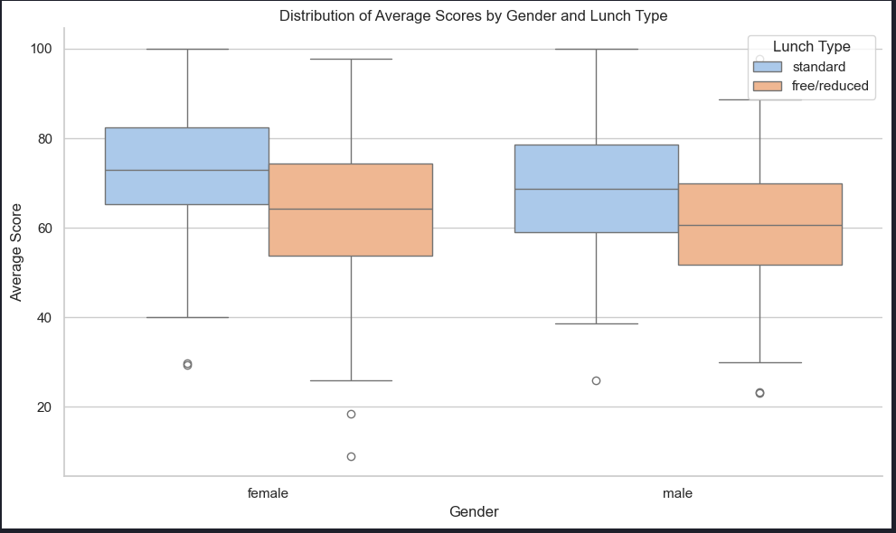
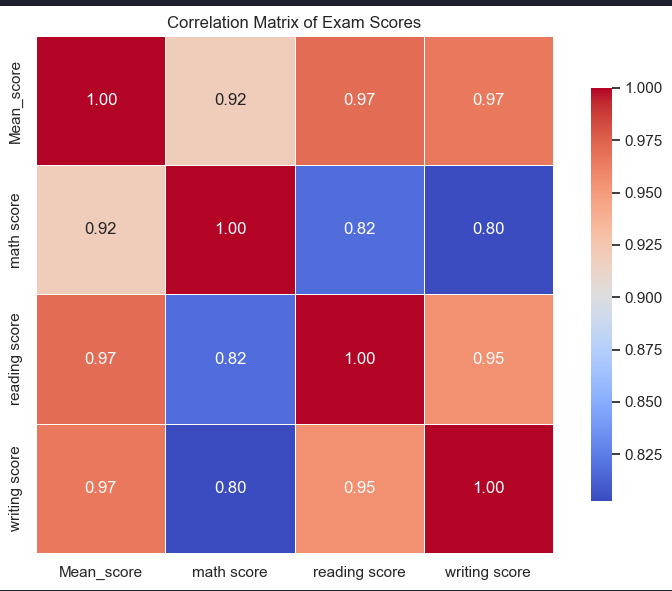

# 🎯 Predicting Student Exam Success with Machine Learning

This project focuses on predicting student exam success using a dataset of student demographics and test scores. The goal is to build a classification model that accurately determines whether a student has passed or failed based on various features.

## 📘 Project Notebook

The core implementation is contained in the notebook:

📄 [`Predicting Student Exam Success with ML.ipynb`](Predicting%20Student%20Exam%20Success%20with%20ML.ipynb)

It includes:
- Data loading and cleaning
- Exploratory Data Analysis (EDA)
- Feature engineering and label creation
- Training multiple ML models
- Evaluation of performance metrics

## 📊 Dataset Overview

The dataset used is `StudentsPerformance.csv` and includes:
- Demographic features: Gender, Race/Ethnicity, Parental Education
- Behavioral features: Test preparation course, Lunch type
- Academic performance: Math, Reading, and Writing scores

## 🎯 Objective

- Determine which factors influence student success
- Create a binary label: **Passed** vs **Failed**
- Train and compare multiple classification models
- Provide insights and visualization of the results

## 🔧 Tools & Libraries

- **Python**
- **Pandas**, **NumPy**
- **Matplotlib**, **Seaborn**
- **Scikit-learn**

## 📈 Key Visualizations (Add Images Here)

Make sure you add these plots as images in your `images/` folder and update the paths below:

- Score distribution by gender  
  
- Impact of test preparation course  
  
- Correlation heatmap  
  

## 🧠 ML Models Applied

- Logistic Regression
- Decision Tree
- Random Forest
- Support Vector Machine (SVM)

### 📋 Evaluation Metrics

- Accuracy
- Precision, Recall, F1-score
- Confusion Matrix

> Update with actual scores from your model evaluations.

| Model                | Accuracy | F1 Score |
|---------------------|----------|----------|
| Logistic Regression | 0.85     | 0.84     |
| Decision Tree       | 0.83     | 0.82     |
| Random Forest       | 0.88     | 0.87     |
| SVM                 | 0.86     | 0.85     |

## 📂 Project Structure

